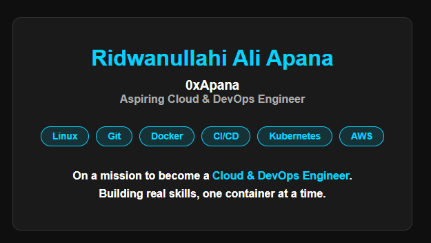

# 🐳 DevOps Portfolio — Dockerized Web App

A personal portfolio website containerized and deployed using Docker and Docker Compose.
Built as part of my hands-on Cloud & DevOps learning journey.

---

## 📸 Preview



---

## 🛠️ Tech Stack

| Tool | Purpose |
|------|---------|
| Linux (Ubuntu) | Base operating system |
| Git | Version control |
| Docker | Containerization |
| Nginx | Web server |
| MySQL | Database |
| Docker Compose | Multi-container orchestration |

'''
---

## 📁 Project Structure
devops-portfolio/
├── website/          # Frontend HTML files
├── Dockerfile        # Docker image instructions
├── docker-compose.yml # Multi-container setup
├── .gitignore
└── README.md
---

## 🚀 How to Run

**Prerequisites:** Docker and Docker Compose installed

```bash
# Clone the repository
git clone https://github.com/0xApana/devops-portfolio.git

# Navigate into the project
cd devops-portfolio

# Start the containers
docker compose up -d

# Visit in browser
http://localhost:8080
```

---

## 🐳 Docker Hub

Image available on Docker Hub:
👉 [0xapana/devops-portfolio](https://hub.docker.com/r/0xapana/devops-portfolio)

```bash
docker pull 0xapana/devops-portfolio
```

---

## 💡 What I Learned

- Writing a Dockerfile from scratch
- Serving static files with Nginx inside a container
- Connecting services using Docker Compose
- Pushing images to Docker Hub
- Managing containers with docker ps, stop, and rm

---

## 👤 Author

**Ridwanullahi Ali Apana**
Aspiring Cloud & DevOps Engineer
GitHub: [@0xApana](https://github.com/0xApana)
